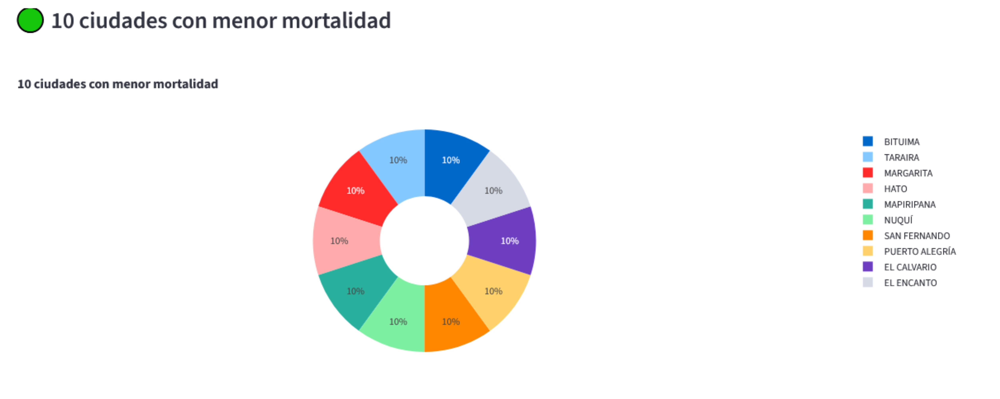
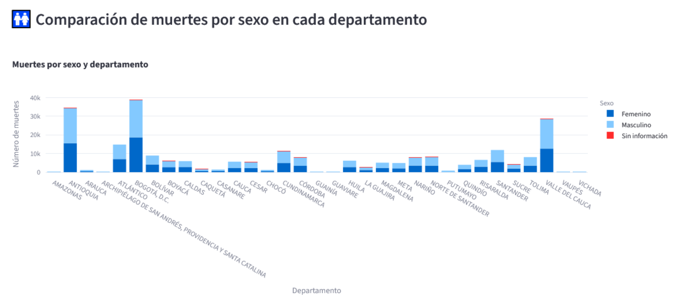
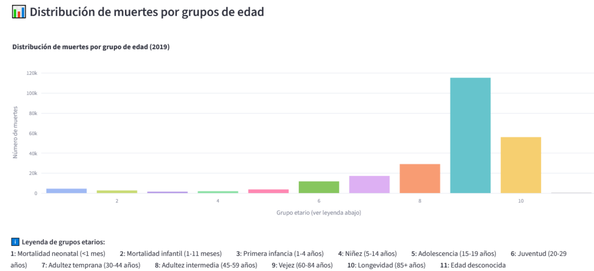

# 📊 Análisis de Mortalidad en Colombia - 2019

**Elaborado por:** ALAIN ALEXANDER CAMACHO  
**Maestría en Inteligencia Artificial** — Universidad de La Salle  

Explora patrones de mortalidad en Colombia durante el año 2019 mediante visualizaciones interactivas. La aplicación permite identificar tendencias demográficas, regionales y clínicas relevantes para la salud pública.

---

## 🎯 Objetivo

Analizar los datos de mortalidad en Colombia durante el año 2019 mediante gráficos dinámicos que revelan patrones por departamento, sexo, edad y causa de muerte. La aplicación busca transformar datos complejos en visualizaciones comprensibles y accesibles.

---

## 🗂️ Estructura del proyecto

- `app.py`: Código principal de la aplicación Streamlit.
- `requirements.txt`: Archivo con las dependencias necesarias para ejecutar la aplicación.
- `data/`: Carpeta que contiene los archivos de entrada:
  - `Anexo1.NoFetal2019_CE_15-03-23.xlsx`: Datos de mortalidad no fetal.
  - `Anexo2.CodigosDeMuerte_CE_15-03-23.xlsx`: Diccionario de causas de muerte (CIE-10).
  - `Divipola_CE_.xlsx`: División político-administrativa de Colombia.
- `assets/`: Recursos gráficos y visualizaciones de las gráficas`.
- `README.md`: Documentación institucional del proyecto.


---

## 🧰 Requisitos

- Python 3.10+
- Librerías utilizadas:
  - `streamlit`
  - `pandas`
  - `plotly`
  - `openpyxl`
  - `Pillow` (para mostrar imágenes)

---

## 🚀 Despliegue (Render)

Pasos seguidos para desplegar la aplicación en [Render](https://render.com):

1. Se creó un repositorio en GitHub con la estructura del proyecto.
2. Se conectó el repositorio a Render mediante la opción “New Web Service”.
3. Se configuró el entorno:
   - **Build command**: `pip install -r requirements.txt`
   - **Start command**: `streamlit run app.py`
4. Se verificó el funcionamiento de la aplicación en línea.

---

## 🛠️ Software utilizado

- Lenguaje: Python
- Framework de visualización: Streamlit
- Librerías: pandas, plotly, openpyxl, Pillow
- Plataforma de despliegue: Render

---

## 💻 Instalación local

Para ejecutar la aplicación localmente:

```bash
# Clonar el repositorio
git clone https://github.com/usuario/repositorio.git
cd repositorio

# Instalar dependencias
pip install -r requirements.txt

# Ejecutar la aplicación
streamlit run app.py

## 📊 Visualizaciones institucionales

### 🗺️ Distribución de muertes por departamento


### 📆 Total de muertes por mes


### 🔫 Cinco ciudades más violentas


### 🧘‍♂️ Diez ciudades con menor mortalidad


### ⚕️ Diez principales causas de muerte


### 🚻 Muertes por sexo y departamento


### 👶 Muertes por grupo etario


