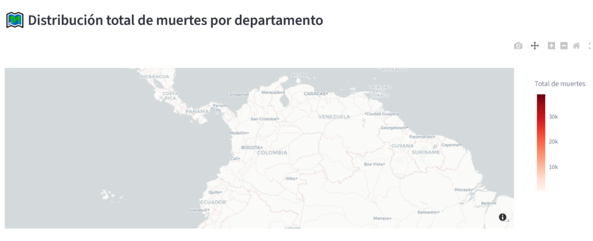
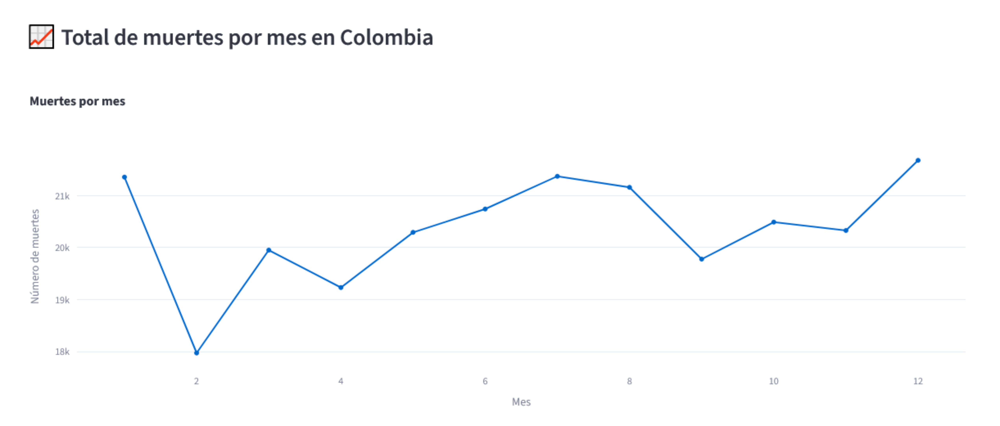
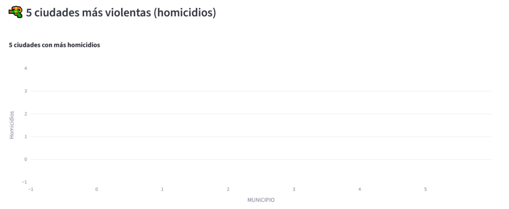
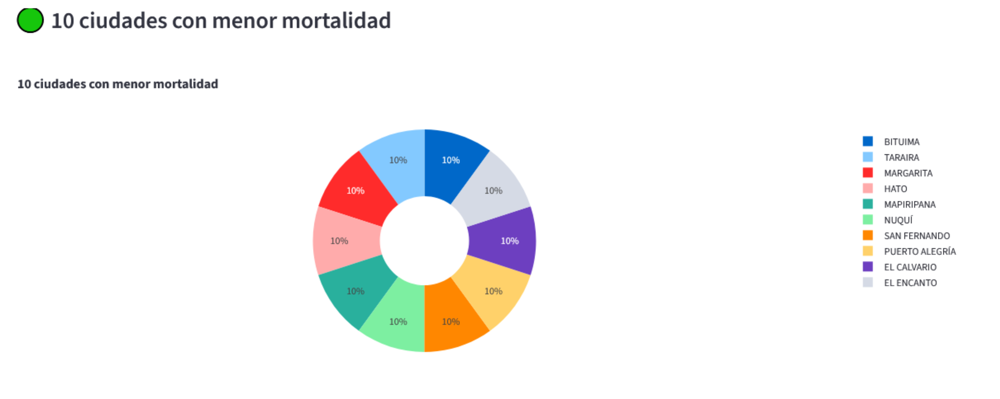
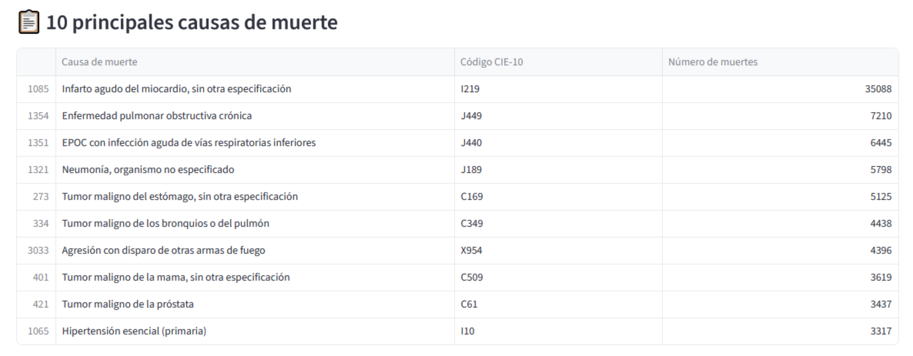
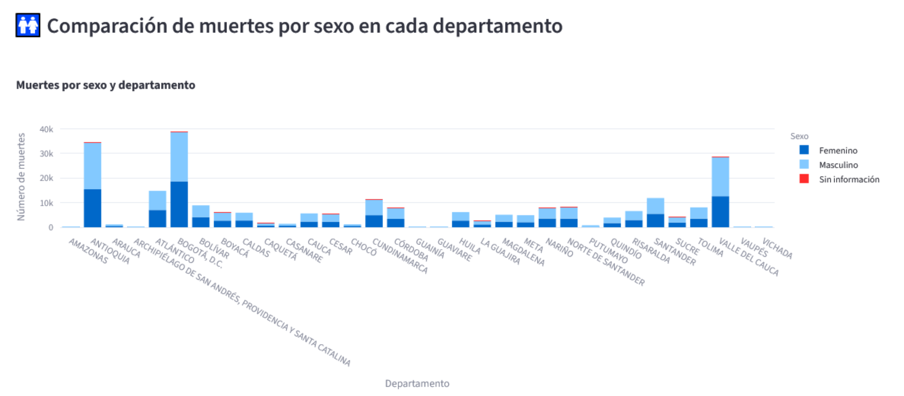
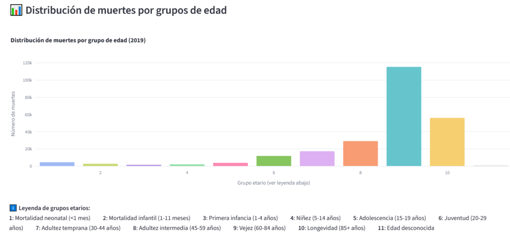

#  Análisis de Mortalidad en Colombia - 2019

**Elaborado por:** ALAIN ALEXANDER CAMACHO  
**Maestría en Inteligencia Artificial** — Universidad de La Salle  

En el marco de la Maestría en Inteligencia Artificial, se desarrolla la actividad 4: Aplicación web interactiva para el análisis de mortalidad en Colombia que tiene como propósito fundamental desarrollar competencias prácticas en el análisis exploratorio de datos (EDA), la visualización dinámica y el despliegue de aplicaciones web en entornos de nube. Para ello, se emplea el lenguaje de programación Python junto con las bibliotecas especializadas Dash y Plotly, herramientas ampliamente utilizadas en la construcción de dashboards interactivos orientados a la toma de decisiones basada en evidencia.
El objeto de estudio es la mortalidad en Colombia durante el año 2019, a partir de los microdatos oficiales suministrados por el Departamento Administrativo Nacional de Estadística (DANE), específicamente los archivos de estadísticas vitales (EEVV). Estos datos, que incluyen variables demográficas (edad, sexo, ubicación geográfica) y clínicas (causas básicas de muerte codificadas según la CIE-10), constituyen una fuente de alto valor epidemiológico. Sin embargo, su volumen y complejidad estructural dificultan su interpretación directa sin el uso de herramientas computacionales avanzadas.
La aplicación web desarrollada responde a esta necesidad mediante la implementación de siete componentes visuales interactivos exigidos por la rúbrica de la actividad: un mapa coroplético de muertes por departamento, un gráfico de líneas de mortalidad mensual, un gráfico de barras de las cinco ciudades más violentas, un gráfico circular de las diez ciudades con menor mortalidad, una tabla con las diez principales causas de muerte, un gráfico de barras apiladas por sexo y departamento, y un histograma de grupos etarios basado en la variable GRUPO_EDAD1 del DANE.
Desde una perspectiva metodológica, el proyecto se estructura en tres fases: integración y limpieza de los datos provenientes de tres archivos fuente (NoFetal2019.xlsx, CodigosDeMuerte.xlsx, Divipola.xlsx); desarrollo de la aplicación Dash con callbacks para gestionar interactividad y el despliegue en una plataforma como servicio (PaaS), en este caso Render, garantizando acceso público mediante una URL estable.
El repositorio GitHub asociado sigue una estructura reproducible: app.py (aplicación principal en Dash).  
Finalmente, desde una perspectiva ética y también desde el capmpo profesional del autor, el desarrollo de la actividad demuestra cómo la inteligencia artificial aplicada al análisis de datos demográficos puede contribuir a la transparencia institucional, la vigilancia epidemiológica y la formulación de políticas públicas focalizadas en salud y seguridad. 

---

## Objetivo

Analizar los datos de mortalidad en Colombia durante el año 2019 mediante gráficos dinámicos que revelan patrones por departamento, sexo, edad y causa de muerte. La aplicación busca transformar datos complejos en visualizaciones comprensibles y accesibles.

---

## Estructura del proyecto

Se presenta la estructura del repositorio en GitHub MORTALIDAD_2019_FINAL:

•	app.py:  Archivo principal de la aplicación desarrollada en Streamlit. Contiene la lógica de carga de datos, procesamiento, generación de visualizaciones interactivas y estructura de la interfaz.  Es el núcleo funcional de la aplicación; su correcta ejecución permite visualizar los análisis de mortalidad.
•	requirements.txt: Archivo con las bibliotecas necesarias para ejecutar la aplicación.  Garantiza la reproducibilidad del entorno en cualquier máquina o plataforma de despliegue como Render.
•	README.md: Documentación y presenación de la aplicación.  Describe el objetivo, estructura, requisitos, pasos de instalación y despliegue, así como las visualizaciones generadas.  Facilita la comprensión de l aplicación.
•	Runtime.txt:  Define la versión de Python requerida para ejecutar la aplicación.  Esencial para entornos de despliegue como Render, donde se necesita especificar el entorno de ejecución.
•	Ver_columnas.py: script auxiliar organziado para determinar el nobre correcto de las columnas de los archivos de excel utilizados. Útil para validar la integridad de los datos antes de integrarlos en la aplicación.
•	data: Carpeta que contiene los archivos de entrada:
	Anexo1.NoFetal2019_CE_15-03-23.xlsx: Datos de mortalidad no fetal.
	Anexo2.CodigosDeMuerte_CE_15-03-23.xlsx: Diccionario de causas de muerte (CIE-10).
	Divipola_CE_.xlsx: División político-administrativa de Colombia.
•	assets: Recursos gráficos y visualizaciones de las gráficas.

---

## Requisitos

•	Python 3.10+
•	Librerías utilizadas:
streamlit==1.39.0
pandas==2.2.3
numpy==1.26.4
plotly==5.24.0
matplotlib==3.8.3
openpyxl==3.1.5
requests==2.32.3
Pillow==10.4.0

---

## Despliegue de la aplicación (Render)

Pasos seguidos para desplegar la aplicación en [Render](https://render.com):

1. Se creó un repositorio en GitHub con la estructura del proyecto.
2. Se conectó el repositorio a Render mediante la opción “New Web Service”.
3. Se configuró el entorno:
   - **Build command**: `pip install -r requirements.txt`
   - **Start command**: `streamlit run app.py`
4. Se verificó el funcionamiento de la aplicación en línea.

---

## Software utilizado

•	Lenguaje: Python
•	Framework de visualización: Streamlit
•	Librerías: 
streamlit==1.39.0
pandas==2.2.3
numpy==1.26.4
plotly==5.24.0
matplotlib==3.8.3
openpyxl==3.1.5
requests==2.32.3
Pillow==10.4.0
Repsitorio: GitHub
Plataforma de despliegue: Render

---

## Instalación local

Para ejecutar la aplicación localmente:

bash
# Clonar el repositorio
git clone https://github.com/alainkapra/MORTALIDAD_2019_FINAL.git
cd MORTALIDAD_2019_FINAL

# Instalar dependencias
pip install -r requirements.txt

# Ejecutar la aplicación
streamlit run app.py

---

## Enlaces de validación

1.	Direccion URL de la aplicación web desplegada en una plataforma como servicio (PaaS):  https://mortalidad-2019-final.onrender.com

2.	Direccioón URL al repositorio del proyecto en GitHub:  https://github.com/alainkapra/MORTALIDAD_2019_FINAL.git

## Visualizaciones institucionales

### Distribución de muertes por departamento
El mapa de Colombia codifica cada departamento con una escala de colores que va desde tonos claros (bajas muertes) a tonos oscuros (altas muertes), utilizando datos agregados del archivo NoFetal2019.xlsx.  Antioquia, Bogotá, Valle del Cauca y Atlántico concentran los volúmenes absolutos más altos de mortalidad.  Este patrón refleja principalmente la asimetría poblacional del país. Según proyecciones del DANE, estos cuatro departamentos albergan cerca del 50 % de la población nacional. 

### Total de muertes por mes
Los meses con mayor mortalidad son enero, julio y diciembre.  Esta estacionalidad sugiere múltiples hipótesis causales. En enero y diciembre (meses de temporada seca y vacaciones en gran parte del territorio colombiano), se incrementan los accidentes de tránsito, las intoxicaciones por alcohol y las muertes por inmersión. Además, estudios epidemiológicos han documentado que las enfermedades cardiovasculares presentan picos en épocas de cambios bruscos de temperatura o de alteración de rutinas (alimentación, sueño, consumo de sal). Julio, por su parte, coincide con el descanso intersemestral y el aumento de movilidad interna, así como con la temporada de lluvias en algunas regiones, lo que puede elevar ciertas enfermedades infecciosas o accidentes. El gráfico de líneas es especialmente útil para que las secretarías de salud planifiquen campañas de prevención anticipadas.

### Cinco ciudades más violentas
Las cinco ciudades más violentas de Colombia en 2019, fueron Cali, Palmira, Buenaventura, Quibdó y Cúcuta.  En un análisis aventurado, estas ciudades han sido señaladas como corredores críticos de violencia asociada a economías ilegales (narcotráfico, minería ilegal, extorsión). Buenaventura y Quibdó, sufren disputas territoriales entre grupos armados que utilizan armas de fuego como herramienta de control social. Cúcuta, fronteriza con Venezuela, ha visto un recrudecimiento de la violencia vinculado al contrabando y la presencia de grupos disidentes.

### Diez ciudades con menor mortalidad
Un gráfico circular o tipo donut que muestra la proporción que representan las diez ciudades con menores conteos de defunciones, respecto del total nacional (en porcentaje).  Ciudades como Mitú, Puerto Carreño, Leticia, Yopal, entre otras, registran volúmenes muy bajos de mortalidad absoluta. Si bien estos bajos números podrían interpretarse superficialmente como “ciudades más seguras o saludables”, es fundamental contextualizar que en su mayoría son capitales departamentales de baja densidad poblacional (Amazonas, Vaupés, Guainía, Casanare). Adicionalmente, persisten problemas de subregistro de defunciones en zonas rurales dispersas y de difícil acceso, donde muchas muertes no son certificadas por un médico ni notificadas al DANE. El gráfico circular, en este sentido, invita a una lectura crítica: la baja mortalidad absoluta no equivale a baja mortalidad relativa. Desde la perspectiva de la actividad, este gráfico cumple el requisito formal.

### Diez principales causas de muerte
Dentro de las 10 principales causas de muete en 2019, llama la atencion que las causas pulmonares se encuentran dentrode los primeros niveles, seguidas de las caucas cancerígenas.
El infarto agudo de miocardio (I219) lidera, seguido de la EPOC (J449), neumonía (J189).  El domino de las enfermedades cardiovasculares y respiratorias crónicas refleja la transición epidemiológica que experimenta Colombia desde hace tres décadas, con un envejecimiento progresivo de la población y la consolidación de factores de riesgo como tabaquismo, sedentarismo, dieta no saludable. Por otro lado, la presencia del homicidio entre las diez primeras causas es un marcador de violencia endémica, diferenciando a Colombia de países con perfiles epidemiológicos similares pero sin conflicto armado interno activo. 

### Muertes por sexo y departamento
Cocordante con la densidad poblacional del país la mayoria de muertes se dan en los centros más poblacos, como lo son Bogotá y los departamentos de Antioquia y Valle del Cauca. En todos los departamentos, la mortalidad masculina supera a la femenina. La brecha es más pronunciada en departamentos con alta violencia (Antioquia, Valle, Norte de Santander).

### Muertes por grupo etario
La mayor mortalidad en el 2019 se dio en el grupo etáreo de vejez (60-84 años), la menor en el grupo de la primera infancia (1-11 meses).

